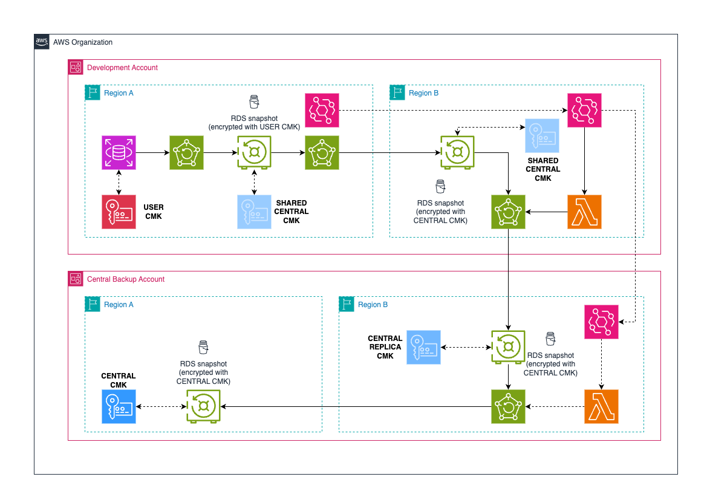
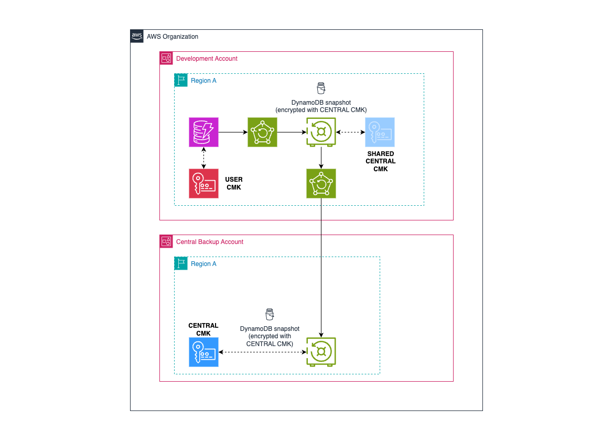
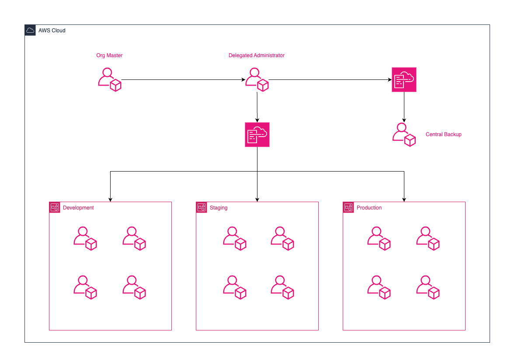

# aws-backup-central
Test of cross account back up solutions in AWS

Deployment order:
1. destination/region-a
2. destination/region-b
3. source/rds (primary region) / source/dynamodb
4. source/rds (secondary region)

## Important
Under settings in AWS Backup:
- Enable both RDS and DynamoDB in __'Service opt-in'__
- Enable DynamoDB __'Advanced features'__ in __'Advanced features for Amazon DynamoDB backups - new'__

## RDS

## DynamoDB

## Organization Structure
